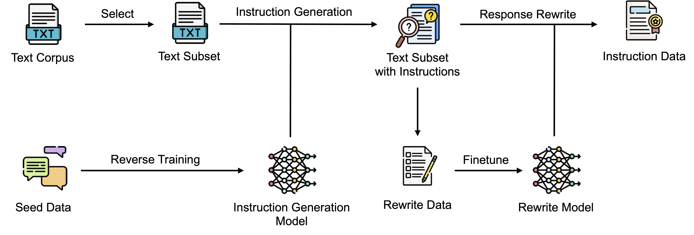

# REInstruct

This is the official repository for ACL 2024 Findings paper "REInstruct: Building Instruction Data from Unlabeled Corpus".



## Installation

```
# create conda environment
conda create -n re_instruct python=3.8
conda activate re_instruct

# editable install
pip install -e .

# install flash attention separately
pip install flash-attn==2.5.7
```

## Prepare Unlabeled Texts

Download [C4 dataset](https://huggingface.co/datasets/allenai/c4) and decompress text files in `en` folder. Select candidate texts using the following scripts:

```bash
python re_instruct/data/prepare_unlabeled_texts.py \
    --c4_en_dir <path_to_c4_en_folder> \
    --output_dir <output_dir>
```

## Training

Example script for finetuning using 8 A100-80G GPUs:

```bash
torchrun --nproc_per_node=8 --master_port=2404 re_instruct/train/sft.py \
    --data_path data/dummy_instruction_data.json \
    --model_name_or_path huggyllama/llama-7b \
    --model_max_length 2048 \
    --output_dir exps/dummy_sft \
    --max_steps 100 \
    --per_device_train_batch_size 1 \
    --gradient_accumulation_steps 16 \
    --bf16 True \
    --evaluation_strategy no \
    --save_strategy steps \
    --save_steps 50 \
    --save_only_model True \
    --optim adamw_torch \
    --learning_rate 2e-5 \
    --lr_scheduler_type constant \
    --fsdp "full_shard auto_wrap" \
    --tf32 True \
    --gradient_checkpointing True \
    --report_to wandb \
    --run_name dummy_sft \
    --logging_steps 1
```

## Inference

Example script for inference using 8 A100-80G GPUs:

```bash
accelerate launch --num_processes=8 re_instruct/inference/generate_output.py \
    --data_path data/dummy_instruction_data.json \
    --model_name_or_path <path_to_trained_checkpoint> \
    --output_dir exp_data/dummy_inference \
    --prompt_type <prompt_type> \
    --max_new_tokens 512 \
    --do_sample False
```

## Filter Rewritten Responses

To filter out failed rewritten responses:

```bash
python re_instruct/data/filter_rewritten.py \
    --data_path <path_to_data_for_filtering> \
    --output_dir <output_dir> \
    --remove_refusal True
```

## Sunburst Visualization

[Install required dependency](https://github.com/nikitakit/self-attentive-parser#installation) and visualize instructions using the following scripts:

```bash
python re_instruct/data/sunburst_visualize.py \
    --data_path example.json \
    --output_svg_path example.svg
```
